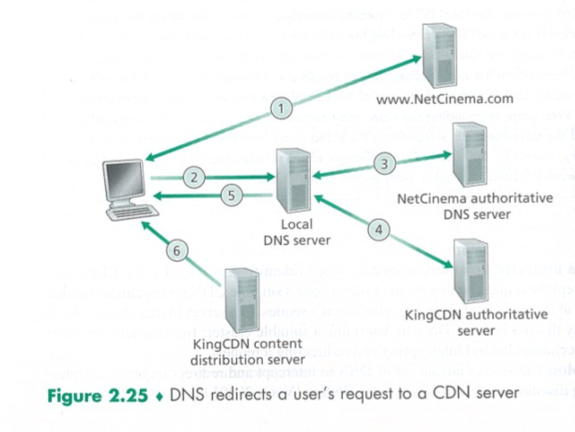

# Report on CDN

## *11811704 Guo Yongshan*

| LAB REPORT REQUIREMENTS                               |
| ----------------------------------------------------- |
| 1. How does CDN work?                                 |
| 2. How to access the CDN network (Two different ways) |

## Problems & Answers

### Problem 1 How does CDN work?

#### Why CDN?

Content Distribution Network (CDN) has been widely used by many Internet video companies, such as YouTube and Switch. The stream media choose CDN rather than straight-forward approach to the client for three reasons:

> 1. If the client is far from the data center, server-to client packets will cross many communication links and likely pass through many ISPs, some of which provides a throughput less than the video consumption rate. Therefore annoying freezing delays for the user are created.
>  
> 2. A popular video will likely be sent many times over the same communication links, but the Internet video company pays its provider ISP for the same bytes over and over again.
>  
> 3. If the data center or its links to the Internet goes down, none video streams would be available.

#### How do CDNs intercept and redirect a request?

Most CDNs take advantage of DNS to intercept and redirect requests, to determine a suitable CDN server cluster for the client at that time, and redirect the request to a server in that cluster. Let's take NetCinema as the example.

> 1. The user visits the Web page at NetCinema.
> 2. When the user clicks on a certain link to a video, for example `http://video.netcinema.com/6Y7B23V` , the user's host sends a DNS query for video.netcinema.com.
> 3. The user's Local DNS Server (LDNS) relays the DNS query to an authoritative DNS server for NetCinema, which observes the string *video* in the host name video.netcinema.com. To *hand over* the DNS query to KingCDN, instead of returning an IP address, the NetCinema authoritative DNS server returns to the LDNS a host name in the KingCDN's domain, for example `a1105.kingcdn.com`.
> 4. From this point on, the DNS query enters into KingCDN's private DNSS infrastructure. The user's LDNS then sends a second query, now for `a1105.kingcdn.com`, and KingCDN's DNS system eventually returns the IP addresses of a KingCDN content server to the LDNS. It is thus here, within the KingCDN's DNS system, that the CDN server from which the client will receive its content that is specified.
> 5. The LDNS frwards the IP address of the content-serving CDN node to the user's host.
> 6. Once the client receives the IP address for a KingCDN content server, it establishes a direct TCP connection with the server at that IP address and issues an HTTP GET request for the ideo. If DASH is used, the server will first send to the client a manifest file with a list of URLs, one for each version of the video, and the clent will dynamically select chunks from the different versions.

### Problem 2 How to access the CDN network(Two different ways)

Two different server placement philosophies are adopted:

> **Enter Deep.** Enter deep into the access networks of ISPs by deploying server clusters in access ISPs all over the world. These CDN servers are close to end users.
>  
> **Bring Home.** Bring the ISPs home by building large cluster at a smaller number of sites. These CDNs typically place their cluster in IXPs.

### Summary and Analysis

In addition to usage of CDN, the cluster selection strategy of the CDN deployment also matters. One simple strategy is to assign the client to the cluster that si geographically closest, but this strategy ignores the variation in delay and available bandwidth over time of Internet paths. Therfore, CDNs must have its cluster periodically send probes to all of the LDNSs in order to perform periodic real-time measurements of delay and loss performance.
